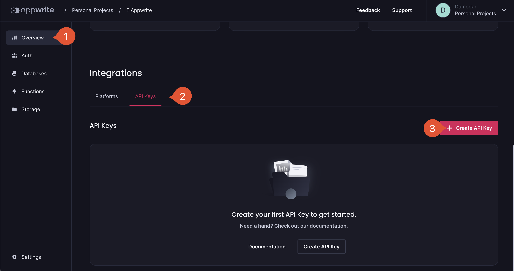
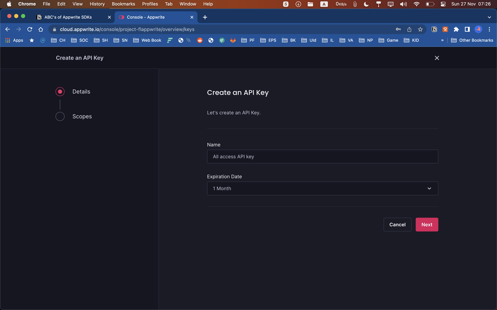
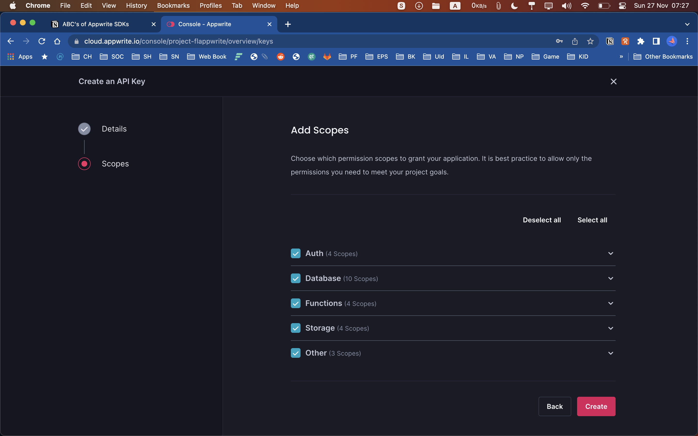
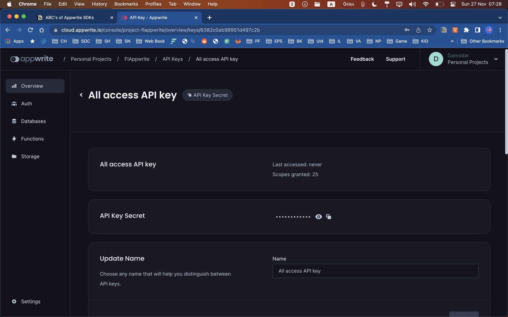

Appwrite’s server side SDKs provide a way to extend Appwrite and build our own custom services on top of it as server side integration has elevated permissions and access. It is mostly useful for setups, configurations and extending Appwrite to build your own custom features on top of it. It can even be used with Appwrite’s Functions to extend and add new functionalities. As it uses API keys wit elevated access that is given to the key, you must be careful not to expose such services to public. With permitted keys, they can have unrestricted access to resources on your Appwrite instance. We will look into details in the next steps how to allow only needed permissions to an API key so that even if it’s exposed only the resources it has access to is affected.

### API Keys

So the first thing you need to do to integrate with a server side SDK is to get the API key. API key are per project, so you can get the API key from your project overview. To get the API key, login to your Appwrite console and select the project of your choice.

Once on the project overview, if you scroll to bottom you will find `Platforms` and `API Keys`, two options. We will learn about platforms in next section. Click on the API keys and then **Create API Key** button.



It will load a wizard where you can give the recognizable name (write the name based on where you are using your key so that it’s easy to figure out) and expiration date for the API Key.



Then click on **Next** button and select the scope of the API Key. Only the given scope is accessible using that key.



For example if you give your key only [databases.read](http://database.read) scope then the key can only read databases and do nothing more. It is always recommended to give keys only the limited access that is required by our application. We can always edit and update the access the key has. Once you select the scopes and click on the **create** button the API key will be created and you can get it’s secret and other details. 



To view the actual API key secret, click on the eye icon next to the API Key Secret. Or you can directly copy to clipboard by clicking on the copy icon.

Once you have the key secret, you can now install and initialize Appwrite’s server-side SDKs and connect to the server. We also need the server endpoint and project id so that our SDK can connect to the correct server and correct project.

### Adding Dependency

Appwrite provides officially supported server side SDKs for various platforms including NodeJS, Dart, Python, PHP, Kotlin, Swift and more. You can find the name and details of the SDK for the platform of your choice from [https://appwrite.io/docs/sdks](https://appwrite.io/docs/sdks) in the **Server SDKs** section. Let’s see couple of examples.

Node JS SDK

In order to install Node JS SDK you can directly run the following command from the terminal in the root of your NodeJS project.

```bash
npm install node-appwrite --save
```

Or, if you like you can manually add the `node-appwrite` under dependencies in your project’s `package.json` file. You can find the details of latest releases on the [SDK’s GitHub repository](https://github.com/appwrite/sdk-for-node).

```json
"dependencies": {
    "node-appwrite": "<version>",
}
```

Dart SDK

In order to install Dart SDK, you can directly run the following command from the terminal in the root of your Dart project.

```bash
pub get dart_appwrite
```

Or, if you want to manually add, you can do so by adding `dart_appwrite` under dependencies in your project’s `pubspec.yaml` file as the following. You can find the details of latest release on the [SDK’s GitHub repository](https://github.com/appwrite/sdk-for-dart).

```yaml
dependencies:
	dart_appwrite: <version>
```

### Initializing and Using SDK

Once you install the SDK, next before using, you need to initialize it with endpoint, project and API Key. To get the endpoint and project head over to settings page for your project in the console. There you can find the project ID and the API Endpoint.


Dart SDK

```dart
import 'package:dart_appwrite/dart_appwrite.dart';

void main() async {
  Client client = Client()
    .setEndpoint('http://[HOSTNAME_OR_IP]/v1') // Make sure your endpoint is accessible
    .setProject('5ff3379a01d25') // Your project ID
    .setKey('cd868c7af8bdc893b4...93b7535db89')
    .setSelfSigned(); // Use only on dev mode with a self-signed SSL cert

  Users users = Users(client);

  try {
    final user = await users.create(userId: ID.unique(), email: ‘email@example.com’,password: ‘password’, name: ‘name’);
    print(user.toMap());
  } on AppwriteException catch(e) {
    print(e.message);
  }
}
```

Node JS SDK

```jsx
const sdk = require('node-appwrite');

let client = new sdk.Client();

client
    .setEndpoint('https://[HOSTNAME_OR_IP]/v1') // Your API Endpoint
    .setProject('5df5acd0d48c2') // Your project ID
    .setKey('919c2d18fb5d4...a2ae413da83346ad2') // Your secret API key
    .setSelfSigned() // Use only on dev mode with a self-signed SSL cert
;

let users = new sdk.Users(client);
let promise = users.create(ID.unique(), 'email@example.com', 'password');

promise.then(function (response) {
    console.log(response);
}, function (error) {
    console.log(error);
});
```

If you look at the codes above for Dart and NodeJS they look pretty similar. Apart from the subtle difference in the syntax of the language itself, the SDK is pretty similar on how they are initialized and use. That’s the beauty of Appwrite’s SDK, they are consistent across platforms and languages as far as it can be without hurting the platforms norms.